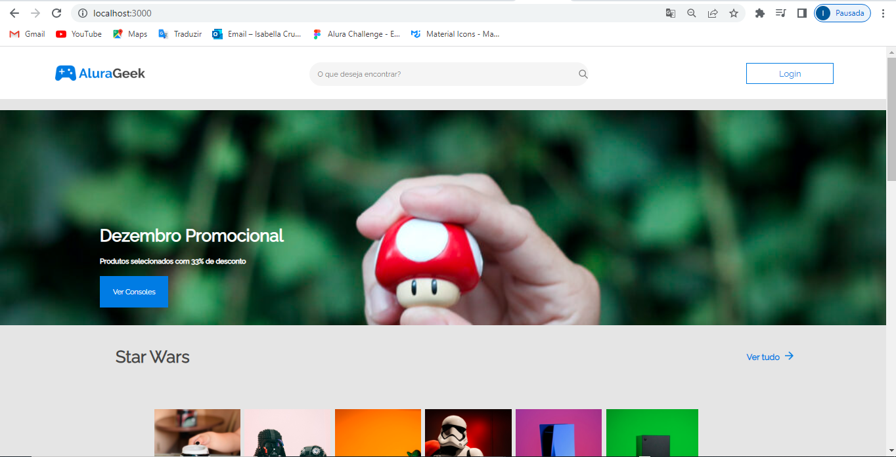
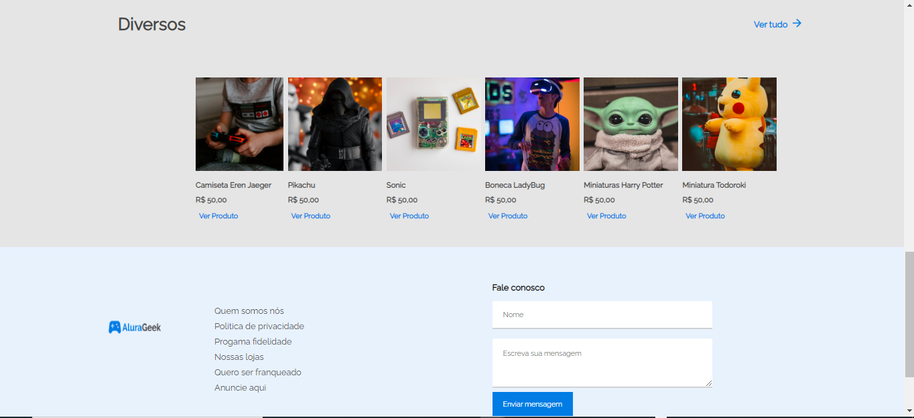
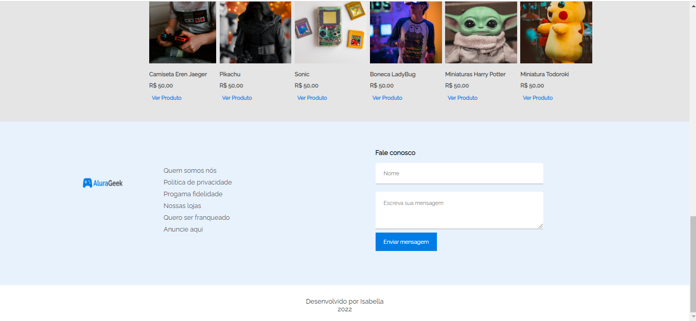
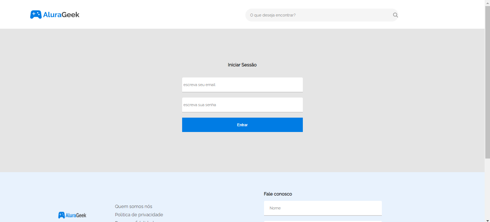
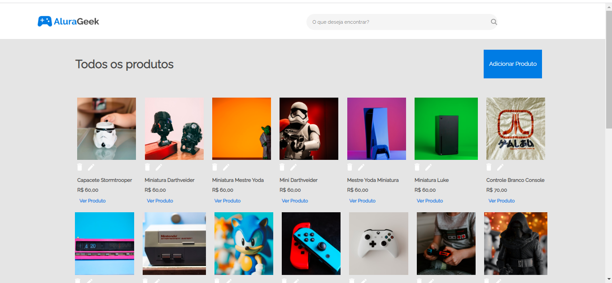
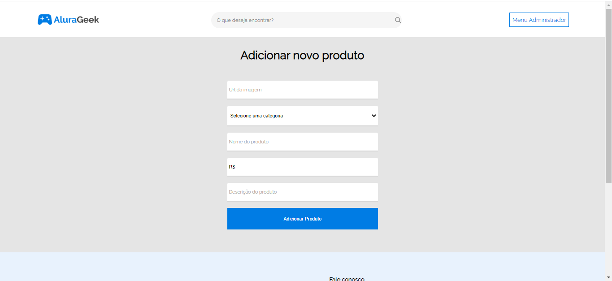
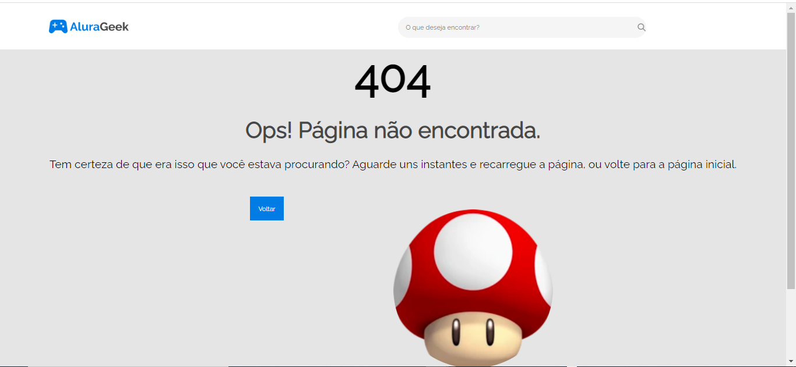
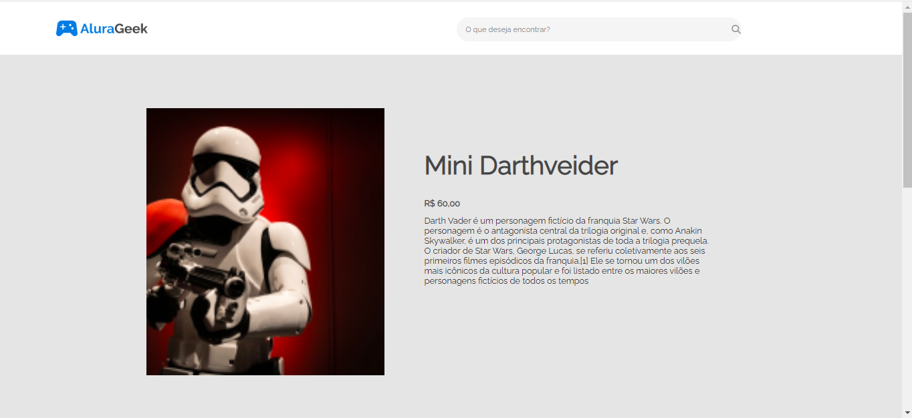
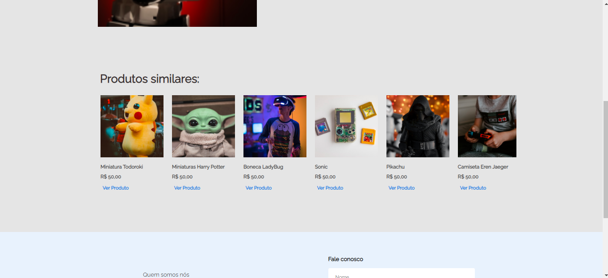

# Criando uma SPA com React e suas bibliotecas
    O alura geek é uma loja virtual onde você pode cadastrar seus produtos e vizualizar informações sobre os produtos cadastrados

## Página HOME (principal)
    Nessa página você pode navegar pelos produtos que estão separados por categoria. Ao clicar no botão "login", o usuário é encaminhado para a página de login. Com o botão "ver consoles" o usuário é encaminhado para a página onde ele pode ver somente os consoles. Ao clicar na logo do Alura Geek, o usuário retorna para a parte de início. Você também pode clicar no botão "ver produto" para ser encaminhado para a página do respectivo produto, onde você pode ver mais detalhes sobre ele. 

## Página LOGIN 
    Aqui o usuário pode preencher as informações solicitadas para realizar um login na página, o usuário pode acessar a página de login clicando no botão de login. 

## Página TODOS OS PRODUTOS 
    Ao clicar no botão "Ver Tudo" na página home, o usuário é encaminhado para a pagina onde ele pode vizualizar todos os produtos existentes. Nessa página há um botão de "cadastrar produto", onde o usuário é encaminhado para a mesma. 

## Página CADASTRAR PRODUTO
    Aqui, o usuário preenche o formulário, cadastrando um novo produto na parte principal. 

## Página NOT FOUND 
    o usuário é encaminhado para essa página, caso digite alguma URL que não existe. 

## Página PRODUTO INDIVIDUAL 
    ao clicar num produto, o usuário pode ver mais detalhes sobre ele. 

